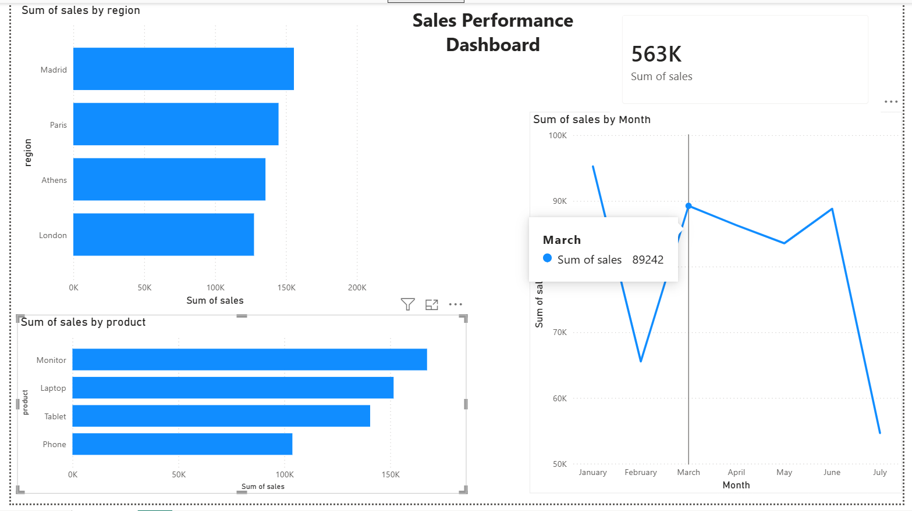

# Sales Performance Dashboard

## Overview
An interactive sales dashboard built in Power BI analysing sales performance across regions, products and time.

## Dashboard

## Key Findings
- Madrid had the highest total sales across all regions
- Monitor was the best selling product, followed by Laptop
- Sales peaked in March and June
- Total sales across all regions: 563K

## Tools Used
- Power BI Desktop
- Python (Pandas) — used to generate the dataset

## Data
200 sales transactions across 4 regions (London, Athens, Madrid, Paris) and 4 products (Laptop, Phone, Tablet, Monitor) from January to July 2023.
